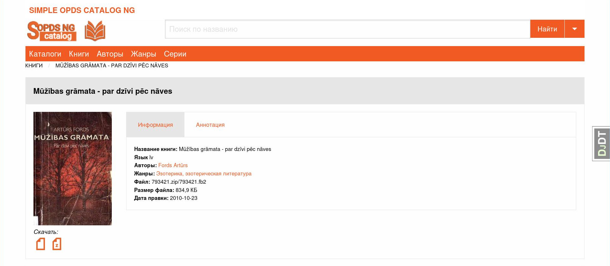

#### SimpleOPDS Catalog NG (new generation) - Простой OPDS Каталог НП (новое поколение)
#### Based on SimpleOPDS Catalog by Dmitry V.Shelepnev
#### Author: Valery A. Ilychev
#### Версия 1.0.0RC1

[English README.md](README.md)
[Документация по развёртыванию](docs/deploy.md) |
[Документация по миграции](docs/migration.md)

Это форк проекта [SimpleOPDS Catalog](https://github.com/mitshel/sopds) Дмитрия Шелепнева. Исходный проект неактивен с апреля 2019 года.

Относительно исходного проекта планируются следующие изменения:

1. Работа только с БД postgresql. Django поддерживает работу с другими БД и скорее всего SOPDS-NG сможет работать и с mysql, и с sqlite, но это требует дополнительного тестирования.

2. Изменение базовой верстки (в процессе).

3. Возможность запустить SOPDS-NG в контейнере docker/podman (в процессе).

В настоящий момент внесены следующие изменения:

1. Исправлены выявленные ошибки, применены изменения, сформированные сторонними контрибюторами в pull-реквестах для исходного проекта.

2. Для работы приложения используется wsgi-сервер gunicorn. Встроенный сервер django не используется.

3. Структура исходного кода реорганизована для более удобного управления.

4. Используются актуальные инструменты управления (uv, mypy и т.п.)

Все изменения вносятся в ветку dev текущего репозитория

#### Технический стэк

- Python 3.13

- Django 5.2

- PostgreSQL 17

- gunicorn

- docker
